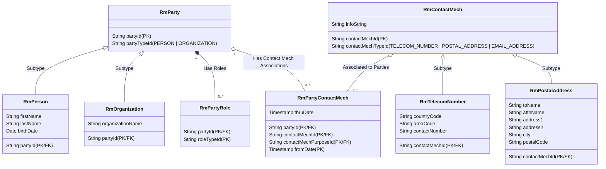

# Module 4: Relationship Manager (relationshipmgr) Plugin

This plugin implements the **Relationship Manager** custom component for Apache OFBiz, fulfilling the requirements of the Module 4 assignment. It models Parties (People & Organizations), Party Roles, and Contact Mechanisms (Telecom Numbers & Postal Addresses) using custom database entities, with custom UI screens and forms to manage the data.

---

## 1. Data Model (Entities)

We implement the core data models of the party and contact mechanism domains using custom entities prefixed with `Rm`:



### Key Entity Implementations
1. **Supertype/Subtype Relationships**: `RmPerson` and `RmOrganization` inherit/extend `RmParty` using shared Primary Key `partyId`. `RmTelecomNumber` and `RmPostalAddress` extend `RmContactMech` using shared Primary Key `contactMechId`.
2. **Intersection/Association Entity**: `RmPartyContactMech` resolves the many-to-many relationship between `RmParty` and `RmContactMech` while incorporating contact purposes (e.g. `WORK`, `HOME`) and temporal tracking (`fromDate`, `thruDate`).

---

## 2. Web UI & Screens
The interface is built dynamically using OFBiz screen widgets and form widgets:
* **Find Party (`FindParty`)**: Shows search criteria, lists all created parties, and includes quick single-row creation forms for new Persons and Organizations.
* **Edit Party (`EditParty`)**: Accessible by clicking on any Party ID.
  * **Dynamic Detail Sections**: Inspects the party type and renders either **Edit Person Details** or **Edit Organization Details** using non-colliding context variables (`rmPerson`/`rmOrganization`).
  * **Party Roles**: Displays active assigned roles and allows assigning new roles (e.g., Student, Faculty, Department) via drop-down.
  * **Contact Mechanisms**: Lists all contact details with active status and an **Expire** action link to mark them inactive.
  * **Add Contact Forms**: Separate dedicated panels to add New Emails, Telecom Numbers, and Postal Addresses.

---

## 3. Demo Data
The system is pre-loaded with custom demo records representing a college environment:
* **Organizations**:
  * `ORG_COLLEGE` (Greenfield Institute of Technology)
  * `ORG_CS_DEPT` (Department of Computer Science)
  * `ORG_MATH_DEPT` (Department of Mathematics)
* **People & Roles**:
  * `STAFF_DR_SHARMA` & `STAFF_PROF_VERMA` (assigned `FACULTY` role)
  * `STUDENT_AMIT` & `STUDENT_PRIYA` (assigned `STUDENT` role)
* **Contacts**: Pre-mapped phone numbers, office postal addresses, and work/home emails for each party.

---

## 4. How to Load and Run

### Step 1: Load Seed and Demo Data
To initialize the MySQL database schemas and load the seed types and demo college data, run:
```bash
./gradlew "ofbiz --load-data"
```

### Step 2: Start the OFBiz Server
To run the server locally:
```bash
./gradlew ofbiz
```

### Step 3: Log In
Access the application and authenticate using the default admin credentials:
* **Username**: `admin`
* **Password**: `ofbiz`
